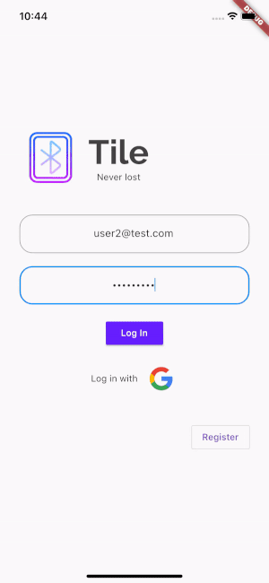
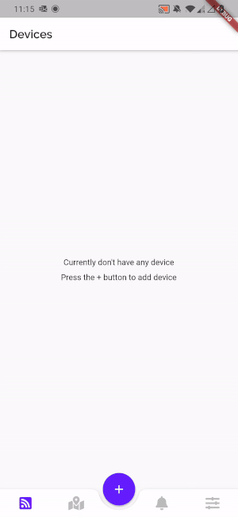
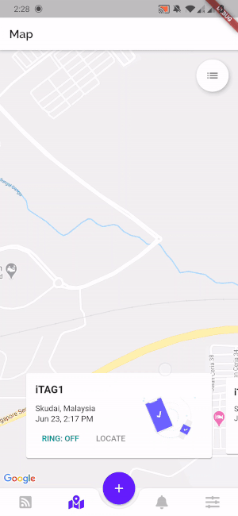
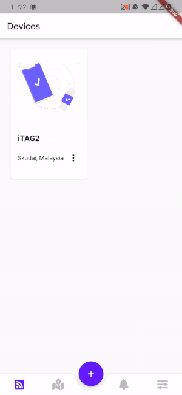
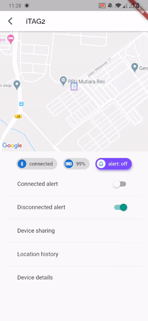
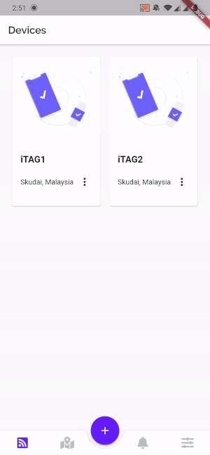

# tile

A Flutter application that connects with Bluetooth tracker to help you track anything.

## Getting Started

This project is a starting point for a Flutter application.

A few resources to get you started if this is your first Flutter project:

- [Lab: Write your first Flutter app](https://flutter.dev/docs/get-started/codelab)
- [Cookbook: Useful Flutter samples](https://flutter.dev/docs/cookbook)

For help getting started with Flutter, view our
[online documentation](https://flutter.dev/docs), which offers tutorials,
samples, guidance on mobile development, and a full API reference.

## Demo

[App walkthrough video](https://youtu.be/tHOQZfkUhVg)

## Features

### User authentication (log in, register, change password)

User can log in and register account with email and password or Google.
Sample user accounts: user1@test.com & user1test, user2@test.com & user2test.

### Connect and add a Bluetooth device

Scan and select the Bluetooth device to connect. Currently support iTAG device.

### Locate device on map

Display Bluetooth devices' last known location on map. The device's last known location will be sent to database after the device is disconnected.

### Device details, location history

Display device's status, available options, location history and device details.

### Trigger alert from the app

Turn on or off the device's alert.

### Send connected/disconnected alert

Push notification when the device is connected/ disconnected. These options can be configured from the device screen.

## Reference

### User

|    Feature       |      Status        |             Description            |
| :--------------- | :----------------: | :--------------------------------  |
| register account | :white_check_mark: | Register account with username, email and password. |
| log in           | :white_check_mark: | Log in with email and password or Google. |
| log out          | :white_check_mark: | Log user out. |
| change password  | :white_check_mark: | Change password in the Settings screen. |

### Device

|    Feature       |      Status        |             Description            |
| :--------------- | :----------------: | :--------------------------------  |
| create device | :white_check_mark: | Create device and save it in database. |
| read devices | :white_check_mark: | Read my devices and shared devices from database. |
| update device | :white_check_mark: | Update device's information and save it in database. |
| delete device | :white_check_mark: | Delete the device from the database. |
| connect device | :white_check_mark: | Connect device with Bluetooth service. |
| disconnect device | :white_check_mark: | Disconnect device with Bluetooth service after device is deleted. |
| reconnect device | :white_check_mark: | Reconnect device with Bluetooth service after app is relaunched. |
| connected/disconnected alert | :white_check_mark: | Push notification when device is connected/disconnected. |
| share device | :white_check_mark: | Share device with other users. |
| save device's location | :white_check_mark: | Save device's last known location after device is disconnected. |

### Tracker

|    Feature       |      Status        |             Description            |
| :--------------- | :----------------: | :--------------------------------  |
| turn on alert | :white_check_mark: | Turn on tracker's alert from the app. |
| turn off alert | :white_check_mark: | Turn off tracker's alert from the app. |
| read battery level | :white_check_mark: | Read tracker's battery level. |
| listen key pressed state | :clock8: | Listen tracker's key pressed state to alert user. |
| listen tracker's RSSI value | :clock8: | Listen tracker's RSSI value to estimate its distance from the user. |
| find tracker with community | :clock8: | Find tracker by updating its location when discovered by other users. |

### Localization (change app's language based on the device's locale)

|    Feature       |      Status        
| :--------------- | :----------------:
| English | :white_check_mark: 
| Chinese | :white_check_mark: 

